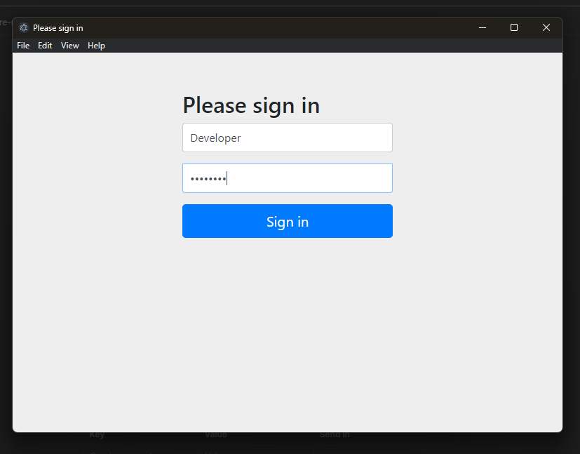

# OAuth2 Authorization and Resource Server

This repository contains a comprehensive implementation of OAuth2 security protocols using Spring Boot. It combines both an OAuth2 Authorization Server and a Resource Server within a single project.

## Features

- **OAuth2 Authorization Server**:
  - Manages user authentication and authorization.
  - Issues access tokens to client applications after successful authentication.
  - Stores user details, client registrations, and authorization grants.
  
- **Resource Server**:
  - Provides protected resources that require OAuth2 access tokens for authentication.
  - Validates access tokens issued by the Authorization Server to grant or deny access to resources.

## Components

### OAuth2 Authorization Server

The OAuth2 Authorization Server handles user authentication and client authorization. It supports:
- User management using a JPA-based `UserDetailsManager`.
- Client registration and management with a `RegisteredClientRepository`.
- Token generation and management through `OAuth2AuthorizationService`.

### Resource Server

The Resource Server exposes protected endpoints that require OAuth2 access tokens for access. It utilizes:
- Spring Security's OAuth2 Resource Server for token validation and authorization.
- JWT token decoding and verification with `JwtDecoder`.

## Usage

1. **Setup**
   - Ensure Java 17+ and Maven or Gradle are installed.
   - Spring Boot 3 +.

2. **Configuration**
   - Customize `application.properties` for both servers as needed.
   - Update the Resource Server's `issuer-uri` to point to the server's base URL of Auth Server.

3. **Building and Running**
   - Build the project using Maven (`mvn install`) or Gradle.
   - Start the application using Maven (`mvn spring-boot:run`) or Gradle.

4. **Testing**
   - Unit tests are included for certain components to ensure functionality and security.
5. **Working through Postman**
    - Make the Authorization to Oauth2 in postman and enter the fields as:
    - 
    - 
    - After entering all the field click <b>Get New Access Token</b>. Then the form login open and after successful sign in the consent page to get the access token and refresh token. 
    - 
    - 
    - 
6. Then use this access token to access <b>"/"</b> url in Resource Server.

## Author

Gaurav Basyal
